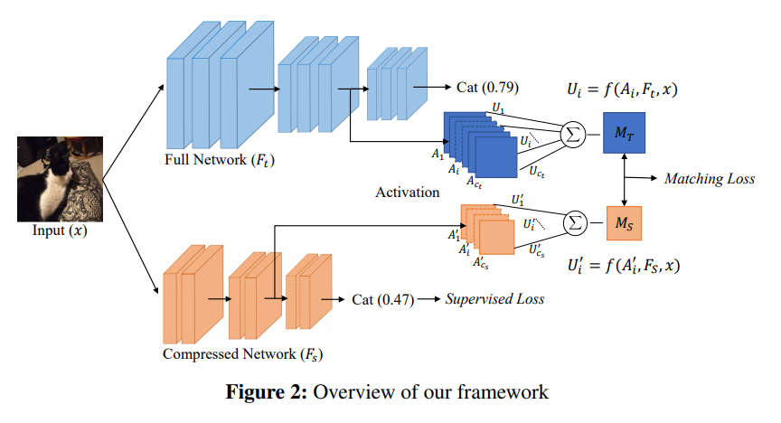

# [Deep Compression: Compressing Deep Neural Networks with pruning, trained quantization and Huffman coding](https://arxiv.org/pdf/2010.15054v1.pdf)

**Problem**: Deployment of neural networks is hard on memory and computational resources, which is especially relevant for embedded devices which are highly constrained environments.

**Solution**:
The authors propose techniques to decrease mostly the memory requirements, but also number of computations significantly.

**Notes**
* Two main issues are identified:
    * Large neural networks can't be put into mobile apps due to the size of their weights, which is restricted by the Apple/Google Play Stores.
    * Many applications are battery constrained, making energy consumption a large issue. The authors note that energy consumption is dominated by memory access. Under 45nm CMOS technology, a 32 bit
floating point add consumes 0.9 pJ (picoJoule, one trillionth of a Joule), a 32bit SRAM cache access takes 5 pJ, while a 32bit DRAM
memory access takes 640 pJ, which is 3 orders of magnitude of an add operation. Large networks
do not fit in on-chip storage and hence require the more costly DRAM accesses. Running a 1 billion
connection neural network, for example, at 20fps would require (20Hz)(1G)(640pJ) = 12.8W just
for DRAM access - well beyond the power envelope of a typical mobile device.

* The results are quite convincing across all compression methods and also improve accuracy values. This method might become standard when compressing neural networks in safety-critical scenarios (see below, the rightmost column is the one trained with attribution preservation, the three to the left of it are standard pruning outputs).

