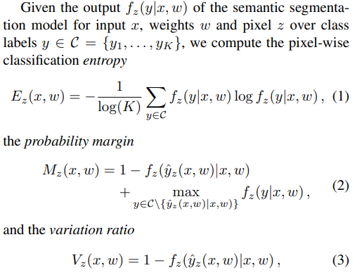
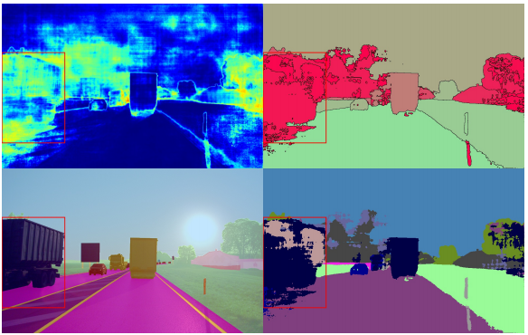

# [Deep Depth from Aberration Map](https://openaccess.thecvf.com/content_ICCV_2019/papers/Kashiwagi_Deep_Depth_From_Aberration_Map_ICCV_2019_paper.pdf)

**Problem**: Passive and convenient depth estimation from singleshot image is still an open problem. Learned deep monocular depth estimation is also limited to an image with sufficient contextual information.

**Solution**: 

**Notes**:
* When a defocused image is taken by a camera, it contains various types of aberrations corresponding to distances from the image sensor and positions in the image plane.
Lens aberrations are generally categorized as *chromatic aberrations* (CA) and *monochromatic aberrations* (MA). In CA, there are two types such as axial chromatic aberrations
(ACA) and transverse chromatic aberrations (TCA). In most cases, ACA and spherical aberrations occur at the center of the image. On the other hand, TCA and coma occur around the corner of the image. These types of aberrations depend on the angle of incidence (on or off axis) of
the light on the lens. 
MA is widely known as five Seidel aberrations: spherical aberrations, coma, astigmatism, curvature of field and distortion.

