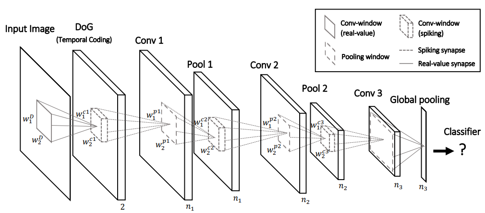

# [STDP-based spiking deep convolutional neural networks for object recognition](https://arxiv.org/pdf/1611.01421.pdf)

**Problem**: It is still unclear how to best encode information and how to best train spiking neural networks (SNNs). In biological neural networks, a process called Spike-timing-dependent plasticity (STDP) governs this.

**Solution**: The authors propose a way to perform STDP in multiple-layer (deep) SNNs using a latency encoding scheme. For details, read on.

**Notes**:
* [Spike-timing-dependent plasticity (STDP)](https://en.wikipedia.org/wiki/Spike-timing-dependent_plasticity) is a biological process that adjusts the strength of connections between neurons in the brain. According to
STDP, synapses through which a presynaptic spike arrived before (respectively after) a postsynaptic one are reinforced (respectively depressed).

* The SNN architecture of the authors is as follows:

